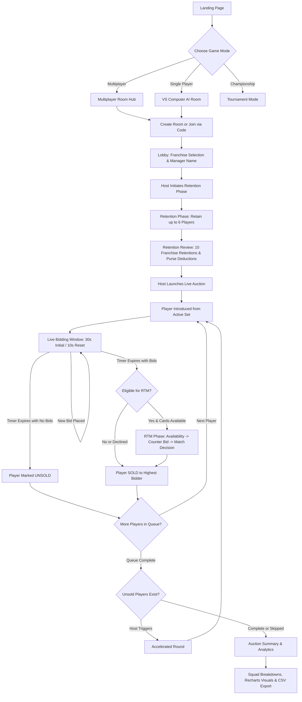

# CricAuctionIPL

> A high-fidelity, real-time Indian Premier League (IPL) mega-auction simulation platform featuring live multiplayer bidding, rule-based algorithmic AI franchises, official BCCI retention and RTM rules, and broadcast-style commentary.

[](https://react.dev/)
[](https://www.typescriptlang.org/)
[](https://vitejs.dev/)
[](https://tailwindcss.com/)
[](https://firebase.google.com/)
[](https://web.dev/progressive-web-apps/)

---

## Live Demo

Experience the live application hosted on Firebase:  
**[https://cricauctionipl.web.app/](https://cricauctionipl.web.app/)**

---

## Overview

**CricAuctionIPL** is a full-stack, real-time web application that authentically models the pressure, strategy, and economic constraints of an official IPL Mega Auction. Whether competing against friends in synchronized multiplayer rooms or challenging computer-managed franchises, users act as team owners and auction strategists responsible for managing budgets, exercising player retentions, bidding under timed clocks, and assembling balanced 18-to-25-player squads within a ₹120 Crore salary cap.

The platform replicates the real-world IPL auction structure—including tiered retention cost structures, dynamic Right-To-Match (RTM) card calculations, standard IPL bid increment slabs, accelerated auction rounds for unsold players, audio-driven hammer effects, and text-to-speech commentary.

---

## Key Features

- **Real-Time Multiplayer Auction Rooms**  
  Synchronized auction state across all participants using Firebase Firestore listeners with atomic transaction locks to eliminate bid race conditions.
- **Rule-Based Algorithmic AI Mode**  
  Autonomous franchise bidding driven by 10 distinct franchise personality profiles (e.g. CSK veteran/all-rounder preference, MI star hunting, RR youth bias), dynamic player valuation models, and strict budget preservation algorithms.
- **Official BCCI Retention System**  
  Pre-auction retention phase allowing franchises to retain up to 6 players (max 5 capped, max 2 uncapped) with tiered purse deduction slabs (₹18 Cr, ₹14 Cr, ₹11 Cr, ₹18 Cr, ₹14 Cr for capped; ₹4 Cr for uncapped).
- **Interactive Right-To-Match (RTM) Workflow**  
  Dynamic calculation of RTM cards (`6 - Retained Players`) and a multi-stage decision flow: triggering RTM, counter-bidding by the highest bidder, and the original franchise exercising or declining the match.
- **Dynamic Bidding Engine & Dual Timers**  
  Enforces official IPL bid increment slabs, custom manual bids, a 30-second opening auction timer, and a 10-second timer reset on new bids.
- **Set-Based Player Queue Management**  
  Categorized auction pools including Marquee Sets 1 & 2, Batters, Bowlers, Wicket-Keepers, and All-Rounders, followed by an optional accelerated round for unsold players.
- **Audio Effects & Speech Commentary**  
  Speech synthesis broadcast commentary, authentic auctioneer gavel hammer effects, and audio sound cues powered by Howler.js.
- **Squad Analytics & Export**  
  Visual squad composition charts and purse distribution graphs built with Recharts, comprehensive team squad breakdowns, and one-click CSV export of auction summaries.
- **Administrative Control Panel**  
  Admin tools for player CRUD operations, drag-and-drop squad reassignments, and bulk player data import via CSV using PapaParse.
- **Authentication & User Profiles**  
  Firebase Authentication supporting Email/Password and Google OAuth with manager profiles tracking auctions played, auctions won, and career history.
- **Progressive Web App (PWA)**  
  Offline-capable shell, manifest configuration, service worker caching, and an "Add to Home Screen" prompt for mobile and desktop experiences.

---

## Auction Flow



### Step-by-Step Walkthrough

1. **Landing & Authentication**: Users sign in via Google or Email/Password, review personal career stats, or explore open rooms.
2. **Room Creation & Lobby**: The host generates a game room (e.g. `CAIPL1234`). Participants select from the 10 official IPL franchises. Remaining franchises are automatically assigned to AI managers.
3. **Retention Phase**: Franchises review their squads and retain up to 6 players adhering to capped/uncapped limits. Purses are deducted, and remaining slots determine available RTM cards.
4. **Retention Review**: All participants inspect the locked retention rosters, deducted budgets, and RTM card allocations across all 10 franchises.
5. **Live Auction & Bidding**: Players are queued by sets (Marquee, Batters, Bowlers, Wicket-Keepers, All-Rounders). The auctioneer opens bidding at base price with a 30-second clock. Any new bid resets the clock to 10 seconds.
6. **RTM Resolution**: If the winning bidder is not the player's previous franchise, and that franchise holds RTM cards, the RTM engine initiates:
   - *Stage 1 (Availability)*: Previous franchise declares intent to use RTM.
   - *Stage 2 (Counter-Bid)*: Winning bidder raises the counter-bid.
   - *Stage 3 (Final Match)*: Previous franchise matches the counter-bid to acquire the player, or declines.
7. **Accelerated Round**: Once scheduled sets finish, the host can trigger an accelerated round to re-auction unsold players.
8. **Final Squad & Analytics**: Review team purses, squad composition (batsmen, bowlers, overseas limits), view comparative charts, download reports as CSV, or restart the session.

---

## Technology Stack

| Layer | Technologies Used |
| :--- | :--- |
| **Frontend Framework** | [React 18.3.1](https://react.dev/) with [TypeScript 5.8.3](https://www.typescriptlang.org/) |
| **Build & Bundling** | [Vite 5.4.19](https://vitejs.dev/) with [@vitejs/plugin-react-swc](https://github.com/vitejs/vite-plugin-react-swc) |
| **Routing** | [React Router DOM 6.30.1](https://reactrouter.com/) |
| **Backend & Real-Time DB** | [Firebase Firestore 12.7.0](https://firebase.google.com/docs/firestore) (with client-side fallback/emulation layer) |
| **Authentication** | [Firebase Authentication](https://firebase.google.com/docs/auth) (Google OAuth & Email/Password) |
| **State & Data Fetching** | React Context API, [@tanstack/react-query 5.83.0](https://tanstack.com/query) |
| **Styling & Components** | [Tailwind CSS 3.4.17](https://tailwindcss.com/), Radix UI primitives, [Lucide React](https://lucide.dev/) |
| **Animations & 3D** | [Framer Motion 12.40.0](https://www.framer.com/motion/), `react-parallax-tilt` |
| **Audio & Media** | [Howler.js 2.2.4](https://howlerjs.com/) (sound effects), Web Speech API (synthesized auctioneer commentary) |
| **Data Visualization** | [Recharts 2.15.4](https://recharts.org/) |
| **Utilities & Parsing** | [PapaParse 5.5.3](https://www.papaparse.com/) (CSV import/export), [Zod 3.25.76](https://zod.dev/), `date-fns` |
| **PWA** | [vite-plugin-pwa 1.2.0](https://vite-pwa-org.netlify.app/) |

---

## Architecture

The application is structured into decoupled UI views, dedicated state contexts, and pure TypeScript business logic engines:

```
src/
├── App.tsx                     # Top-level routing, theme providers, dynamic code splitting
├── components/                 # Reusable UI components & auction widgets
│   ├── ui/                     # Radix UI + Tailwind design system primitives
│   ├── BidControls.tsx         # Bidding buttons, quick increments, pass actions
│   ├── CircularAuctionTimer.tsx# SVG countdown timer with radial progress
│   ├── HammerSoldEffect.tsx    # Auction hammer gavel visual animation
│   ├── PlayerCard.tsx          # Broadcast player card with stats, traits, and imagery
│   ├── RTMModal.tsx            # Multi-stage Right-to-Match interactive dialog
│   ├── SoldModal.tsx           # Player sold announcement modal
│   └── TeamGrid.tsx            # Live franchise status grid (purse, squad count, RTMs)
├── contexts/
│   ├── AdminContext.tsx        # Admin role authentication & privileged access state
│   └── GameDataContext.tsx    # Master player catalog & team data provider
├── engine/                     # Pure business logic engines (zero UI dependencies)
│   ├── aiEngine.ts             # Franchise personalities, dynamic valuation, bid decision logic
│   ├── auctionEngine.ts        # Bid validation, increment compliance, squad constraint checks
│   ├── retentionEngine.ts      # BCCI retention allocation, slot pricing, RTM calculations
│   └── rtmEngine.ts            # Finite state machine for RTM stages and timeouts
├── lib/
│   ├── constants.ts            # IPL franchise data, budget rules, increment slabs, timers
│   ├── firebase.ts             # Firebase app, Firestore, and Auth initialization
│   ├── mockFirestore.ts        # In-browser Firestore simulation layer for local execution
│   ├── playerValue.ts          # Algorithmic player valuation heuristics
│   └── sessionService.ts       # Firestore transactions, snapshot listeners, room workflows
└── pages/                      # Route page components
    ├── AdminPage.tsx           # Player & team administration, CSV manager
    ├── Auction.tsx             # Primary auction arena with real-time room synchronization
    ├── Landing.tsx             # Landing hero, game mode selection, quick rules
    ├── Leaderboard.tsx         # Global manager rankings by wins
    ├── Lobby.tsx               # Franchise selection and room waiting room
    ├── Multiplayer.tsx         # Room code generation and session join interface
    ├── Retention.tsx           # Franchise-specific retention selection interface
    ├── RetentionReview.tsx     # 10-team retention review stage
    ├── Summary.tsx             # Post-auction squad analytics, charts, and CSV export
    └── Tournament.tsx          # Multi-step tournament setup and simulation
```

### Concurrency & Real-Time Synchronization

Bids in `sessionService.ts` are processed inside Firestore transactions (`runTransaction`) with exponential backoff retry logic. This guarantees:
1. Two simultaneous bids never overwrite each other.
2. The user's purse is validated against minimum squad reserves before accepting a bid.
3. Every validated bid atomically updates the current bid, highest bidder ID, and resets the countdown timer.

---

## Real-Time Auction System

The live auction state is maintained within a single Firestore document (`sessions/{gameCode}`) accompanied by a subcollection of teams (`sessions/{gameCode}/teams/{teamId}`):

| State Property | Type | Description |
| :--- | :--- | :--- |
| `activePlayerId` | `string \| null` | The player currently on the auction block. |
| `currentBid` | `number` | The current highest bid in Indian Rupees (INR). |
| `currentBidderId` | `string \| null` | The ID of the team holding the highest bid. |
| `timerEndsAt` | `Timestamp \| null`| Server timestamp when the current countdown expires. |
| `status` | `string` | Auction status: `IDLE`, `RUNNING`, `SOLD`, `UNSOLD`, `PAUSED`. |
| `timerMode` | `string` | Active timer category (`AUCTION`, `RETENTION`, `RTM`, `NONE`). |
| `rtmStage` | `string` | RTM state: `NONE`, `AVAILABLE`, `COUNTER_BID`, `FINAL`. |

### Bid Increment Slabs

The engine automatically calculates the minimum permissible increment based on official IPL slabs:

| Current Bid Range | Minimum Increment |
| :--- | :--- |
| **₹0 – ₹1.00 Crore** | ₹5,00,000 (5 Lakhs) |
| **₹1.00 Crore – ₹2.00 Crore** | ₹10,00,000 (10 Lakhs) |
| **₹2.00 Crore – ₹5.00 Crore** | ₹20,00,000 (20 Lakhs) |
| **Above ₹5.00 Crore** | ₹25,00,000 (25 Lakhs) |

---

## AI Auction Mode

The AI bidding engine (`src/engine/aiEngine.ts`) is completely programmatic and deterministic, without reliance on external LLMs or third-party inference APIs.

### Franchise Personalities

Each franchise is configured with distinct bidding biases and role weightings:

- **CSK (Chennai Super Kings)**: High value discipline (1.08), elevated preference for all-rounders (1.28) and veteran players (1.18).
- **MI (Mumbai Indians)**: Aggressive bidding (1.16), high star bias (1.25), focus on pace/bowlers (1.22) and power hitters (1.18).
- **RCB (Royal Challengers Bengaluru)**: High star bias (1.32), heavy batter emphasis (1.30), aggressive pursuit of marquee players.
- **RR (Rajasthan Royals)**: High value discipline (1.20), heavy youth bias (1.25), patient budget-conscious bidding.
- **KKR (Kolkata Knight Riders)**: High aggression (1.25), elevated risk tolerance (1.18), strong preference for all-rounders (1.18).
- **SRH, PBKS, GT, LSG, DC**: Configured with respective biases across bowling depth, overseas targets, and squad balancing.

### Dynamic Valuation Formula

Before making a bid decision, an AI franchise computes an estimated dynamic ceiling:

$$\text{Valuation} = \text{BasePrice} \times (1.1 + \text{Rating} \times 0.82) \times \text{Form} \times \text{Scarcity} \times \text{TeamNeed} \times \text{Personality} \times \text{StarMultiplier}$$

### Budget Preservation Rule

An AI franchise will **never** bid an amount that leaves its remaining purse below the reserve required to fill remaining squad spots at minimum base price:

$$\text{Reserve Required} = (\text{MAX\_SQUAD} - \text{Current Squad Size}) \times \text{MIN\_PLAYER\_BASE\_PRICE}$$

---

## Multiplayer System

- **Room Codes**: Unique 9-character game codes formatted as `CAIPL` followed by 4 random digits (e.g. `CAIPL4921`).
- **Host Privileges**: The room creator has administrative controls to pause/resume the auction, skip players, skip entire sets, trigger accelerated rounds, or end the session.
- **Peer Synchronization**: All clients subscribe to document listeners (`onSnapshot`). UI updates occur instantaneously upon transaction commits.
- **Heartbeat & Reconnection**: Includes a 30-second host reconnection grace window to protect session integrity if the host temporarily loses connectivity.

---

## Retention and RTM

### Retention Rules & Cost Slabs

Teams can retain up to 6 players prior to the auction. Deductions are subtracted directly from each franchise's ₹120 Crore purse:

| Slot Type | Deducted Amount |
| :--- | :--- |
| **Capped Slot 1** | ₹18.00 Crore |
| **Capped Slot 2** | ₹14.00 Crore |
| **Capped Slot 3** | ₹11.00 Crore |
| **Capped Slot 4** | ₹18.00 Crore |
| **Capped Slot 5** | ₹14.00 Crore |
| **Uncapped Slot (Max 2)** | ₹4.00 Crore each |

### Right-To-Match (RTM) Formula

$$\text{RTM Cards Allocated} = \max(0, 6 - \text{Total Players Retained})$$

When an eligible player is provisionally won by another franchise, the original team enters the 3-step RTM sequence handled by `src/engine/rtmEngine.ts`.

---

## Team and Budget Management

All 10 official IPL franchises are modeled with authentic branding, official hex colors, and constraints:

- **Initial Purse**: ₹120,00,00,000 (₹120 Crore)
- **Minimum Squad Size**: 18 players
- **Maximum Squad Size**: 25 players
- **Maximum Overseas Players**: 8 players

The engine actively blocks bids if acquiring a player would violate the maximum overseas limit (8) or the total roster ceiling (25).

---

## UI / UX Design

- **Broadcast Aesthetic**: Dark stadium ambiance with saturated franchise accent colors, glowing borders, and gold accents.
- **Interactive Countdown**: SVG circular countdown timer with color shifts (gold $\rightarrow$ amber $\rightarrow$ red) as time runs low.
- **Sold Animations**: Hammer gavel strike overlay with confetti particles, celebratory modal banners, and audio sound effects.
- **Adaptive Layout**: Optimized for desktop multi-panel displays and mobile viewports with drawer sheets and modal controls.

---

## Project Structure

```
CricAuctionIPL/
├── .firebase/                  # Firebase hosting build cache
├── .firebaserc                 # Firebase project mapping ("cricauctionipl")
├── firebase.json               # Firebase Hosting rewrites and caching headers
├── package.json                # Project dependencies and npm scripts
├── postcss.config.js           # PostCSS configuration
├── tailwind.config.ts          # Tailwind theme extensions and team color classes
├── tsconfig.json               # TypeScript project configurations
├── vite.config.ts              # Vite bundling, aliases, and PWA manifest config
├── public/                     # Static assets, icons, audio files, and web manifest
└── src/
    ├── App.tsx                 # Root application component and route definitions
    ├── main.tsx                # React DOM root render
    ├── index.css               # Global styling, design system tokens, animations
    ├── components/             # Reusable UI elements, modals, panels, and cards
    ├── contexts/               # Admin and Game Data React contexts
    ├── engine/                 # Pure auction, AI, retention, and RTM logic engines
    ├── hooks/                  # Custom hooks (toast, mobile detection, user identity)
    ├── lib/                    # Firebase config, constants, valuation heuristics, session service
    └── pages/                  # Route page components
```

---

## Installation & Local Development

### Prerequisites

- [Node.js](https://nodejs.org/) (version 18.x or higher recommended)
- `npm` or `bun`

### Setup Instructions

1. **Clone the repository**:
   ```bash
   git clone https://github.com/Abhinavm055/CricAuctionIPL.git
   cd CricAuctionIPL
   ```

2. **Install dependencies**:
   ```bash
   npm install
   ```

3. **Start the local development server**:
   ```bash
   npm run dev
   ```

4. **Access the application**:  
   Open your browser and navigate to `http://localhost:8080`.

---

## Production Build

To create an optimized production build:

```bash
npm run build
```

This compiles TypeScript, bundles modules with Vite SWC, minifies CSS/JS assets into the `dist/` directory, and generates service worker precache manifests.

### Deploying to Firebase Hosting

This project is pre-configured with `firebase.json` for Firebase Hosting. To deploy:

```bash
# Install Firebase CLI if not already installed
npm install -g firebase-tools

# Authenticate with Firebase
firebase login

# Deploy the production build
firebase deploy --only hosting
```

---

## Environment Configuration

The client application includes direct initialization in `src/lib/firebase.ts` for the public Firebase web app. 

For developers deploying custom Firebase backends, configuration parameters can be customized directly in `src/lib/firebase.ts` or mapped to standard Vite environment variables:

```env
# Optional Vite environment variable overrides
VITE_FIREBASE_API_KEY=your_api_key
VITE_FIREBASE_AUTH_DOMAIN=your_project_id.firebaseapp.com
VITE_FIREBASE_PROJECT_ID=your_project_id
VITE_FIREBASE_STORAGE_BUCKET=your_project_id.firebasestorage.app
VITE_FIREBASE_MESSAGING_SENDER_ID=your_sender_id
VITE_FIREBASE_APP_ID=your_app_id
```

---

## Future Improvements

The following items are planned enhancements for future releases:

- [ ] **Multi-Voice Audio Commentary**: Expanded speech synthesizer voice selections and multi-language commentary (Hindi, English, regional languages).
- [ ] **Match Simulation Integration**: Direct match simulation engine to play out a tournament season with newly drafted auction squads.
- [ ] **Custom Franchise Creation**: Interface to create custom franchise names, upload logos, and set custom purse limits.
- [ ] **Detailed PDF Squad Reports**: Downloadable high-resolution PDF rosters and budget analytics sheets for offline review.
- [ ] **Spectator Mode**: Dedicated read-only broadcast view for non-bidding viewers and tournament streaming.

---

## Author

**Abhinav M**  
GitHub: [@Abhinavm055](https://github.com/Abhinavm055)

---

## License

No explicit open-source license is currently specified for this repository. All rights are reserved by the author.

